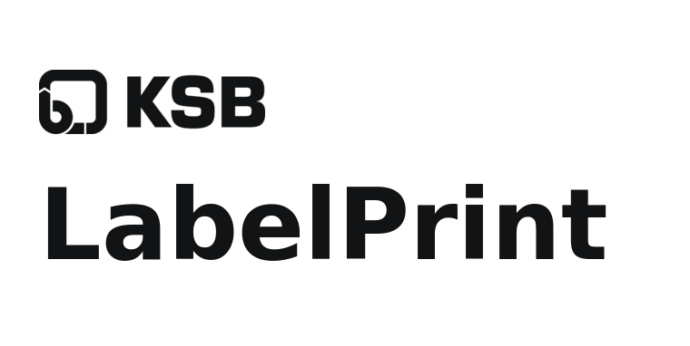
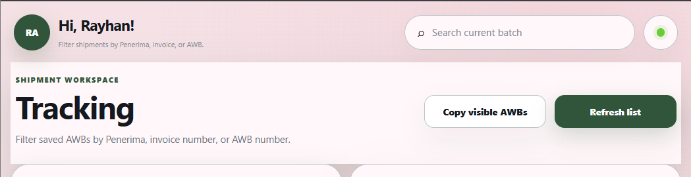

<p align="center">
  <a href="https://rayhanmawuntu-stack.github.io/LabelPrinter/">
    <picture>
      <source media="(prefers-color-scheme: dark)" srcset="docs/labelprint-lockup-dark.png">
      <source media="(prefers-color-scheme: light)" srcset="docs/labelprint-lockup.png">
      
    </picture>
  </a>
</p>

<p align="center">
  A responsive workspace for creating, previewing, printing, saving, and tracking KSB delivery labels.
</p>

<p align="center">
  <strong><a href="https://rayhanmawuntu-stack.github.io/LabelPrinter/">Open the live app</a></strong>
</p>

The frontend runs on GitHub Pages and synchronizes users, batches, tracking data, and analytics with Google Sheets through a Google Apps Script web app.

## Live application

[](https://rayhanmawuntu-stack.github.io/LabelPrinter/)

<p align="center"><sub>Actual PNG capture from the deployed application—not an illustration or reconstructed mockup.</sub></p>

## Features

- Create and edit multiple recipients in one batch
- Original KSB physical label design preserved for printing
- Optional KSB logo on printed labels
- A4 landscape print preview
- Multiple layouts: `3 × 3`, `3 × 2`, `2 × 2`, `2 × 1`, and `1 × 1`
- Fast import from Excel or Google Sheets
- User profiles linked to print activity
- Google Sheets synchronization
- Local cache for offline resilience
- Batch history with reload and delete actions
- Shipment tracking by recipient, invoice number, AWB, source, courier, and delivery status
- Direct printing and Generate & Save both create recoverable batch history
- Dashboard and analytics views
- Top users and top recipients rankings
- Light and dark modes with selectable color schemes
- Responsive desktop and mobile interface
- Automatic optimizations for lower-specification devices
- Compact color-coded synchronization indicators

## Official bulk-input template

Paste tab-separated rows from Excel or Google Sheets in exactly this seven-column order:

| Column | Field | Rule |
|---|---|---|
| A | Date | Accepted for source consistency; not printed on the label |
| B | Penerima | Required recipient or company name |
| C | Invoice Number | Stored with the shipment and searchable in Tracking |
| D | Courier | Defaults to `JNE` when blank |
| E | AWB / Resi | Automatically inserted into the label form and Tracking tab |
| F | Address (Phone Number) | Put the phone number in parentheses at the end of the address |
| G | Attn | Recipient contact or department |

Example:

```text
13-Jul-26	INTI EVERSPRING INDONESIA	882020343	JNE	CSS6301187540988	Plaza Sentral Lantai 5B, Jl. Jend. Sudirman No.47 RT 05/RW 04 Kel. Karet Semanggi, Kec. Setiabudi Jakarta Selatan 12930 (02157905245)	BAG KEUANGAN
```

Download the reusable template from [`templates/bulk-input-template.tsv`](templates/bulk-input-template.tsv). Do not reorder the columns. Keep empty optional values as blank cells so the remaining fields stay in their assigned columns.

## Technology

- HTML, CSS, and vanilla JavaScript
- GitHub Pages
- Google Apps Script
- Google Sheets
- Browser local storage as a temporary cache

## Google Sheets backend setup

1. Create a new Google Sheet.
2. Open **Extensions → Apps Script**.
3. Add the backend code from the `apps-script` directory, or use the complete `Code.gs` backend prepared for this project.
4. Run `setupLabelPrintSheets()` to create or update the required sheets.
5. Approve the requested Google permissions.
6. Select **Deploy → New deployment**.
7. Choose **Web app**.
8. Set:
   - **Execute as:** Me
   - **Who has access:** Anyone
9. Deploy and copy the URL ending in `/exec`.
10. Put the deployment URL in `FIXED_BACKEND_URL` inside `assets/app-fixed-backend.js`, then run `npm run build`.

The backend creates and uses these sheets:

- `Users`
- `Login History`
- `Label History`
- `Generation Log`
- `Shipment Status`

## Frontend deployment

The repository is configured for GitHub Pages deployment. Changes pushed to the `main` branch are deployed through GitHub Actions.

To deploy under another GitHub account:

1. Fork or clone this repository.
2. Open **Settings → Pages** in the GitHub repository.
3. Select **GitHub Actions** as the source.
4. Update the deployment endpoint in `assets/app-fixed-backend.js` when required.
5. Run `npm run build` so the generated browser bundles include the latest source changes.
6. Push the changes to `main`.

## Project structure

```text
LabelPrinter/
├── index.html
├── Code.gs
├── README.md
├── assets/
│   ├── bootstrap.js
│   ├── app-core.bundle.js
│   ├── app-analytics.bundle.js
│   ├── app.bundle.css
│   ├── app-01.js ... app-05.js
│   └── style-01.css ... style-54.css
├── docs/
│   ├── labelprint-lockup.png
│   ├── labelprint-lockup-dark.png
│   └── screenshots/
│       └── tracking-workspace-live.png
├── partials/
│   ├── app-shell.html
│   ├── body-01.html
│   ├── body-02.html
│   ├── body-03.html
│   └── body-04.html
├── templates/
│   └── bulk-input-template.tsv
└── apps-script/
    ├── Api.gs
    ├── Batch.gs
    ├── Helpers.gs
    ├── History.gs
    ├── Login.gs
    ├── Setup.gs
    ├── Storage.gs
    ├── Tracking.gs
    └── Users.gs
```

The numbered JavaScript, stylesheet, and body-part files remain the editable source. After changing them, run:

```bash
npm run build
npm run check
```

The generated bundles reduce the initial application shell from dozens of browser requests to a small set of cached assets. Do not edit generated bundle files directly.

## Data flow

1. Recipient edits are cached locally in the browser.
2. Printed or generated batches are saved to local history immediately.
3. When the Google Sheets backend is available, pending batches are synchronized automatically.
4. Remote users and history are loaded and merged with the local cache.
5. Shipment status changes are stored locally first and synchronized when backend version 1.1 or newer is available.
6. Analytics are calculated from synchronized batch history.

## Sync indicators

- **Green:** synchronized
- **Yellow:** pending or connecting
- **Red:** synchronization error or offline

Select the top status dot to open the backend connection settings and view error details.

## Printing

The print template uses real millimetre dimensions and is intended for **A4 landscape** printing.

For the most accurate result:

- Set paper size to **A4**
- Use **Landscape** orientation
- Set scale to **100% / Actual size**
- Disable browser headers and footers
- Keep margins at the browser default unless the printer requires adjustment

The application interface can be redesigned independently from the physical label template. The original KSB label rules are kept separately in the print stylesheet.

## Troubleshooting

### The app shows a Sheets error

- Confirm the Apps Script URL ends in `/exec`.
- Confirm the web app access setting is **Anyone**.
- Open this URL directly in a browser:

```text
YOUR_APPS_SCRIPT_URL?action=ping
```

A working backend returns JSON containing `success: true`.

### Old interface or data is still visible

Perform a hard refresh:

- Windows: `Ctrl + Shift + R`
- macOS: `Cmd + Shift + R`

For persistent cached data, clear the GitHub Pages site's local storage and reload.

### GitHub deployment is queued

Check the repository's **Actions** tab. GitHub-hosted runners may occasionally take several minutes to start.

## Maintainer

Created and maintained by **Rayhan Ardhana**.
